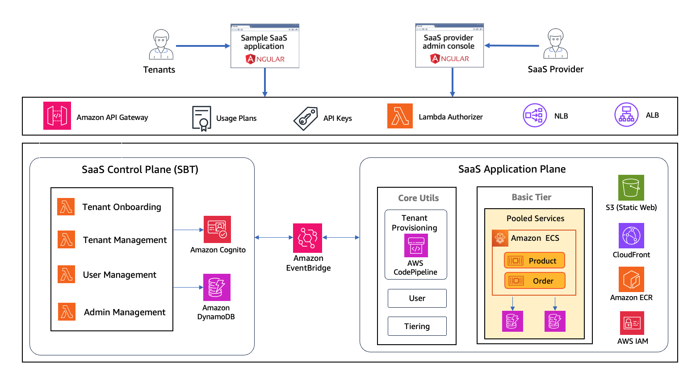
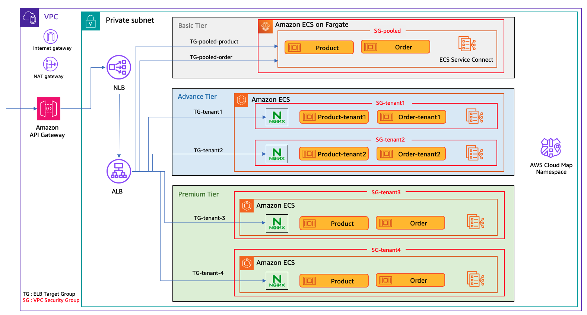
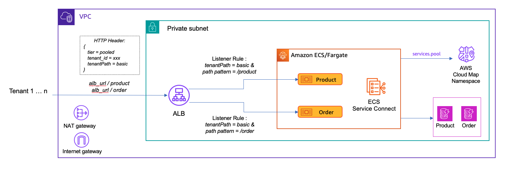
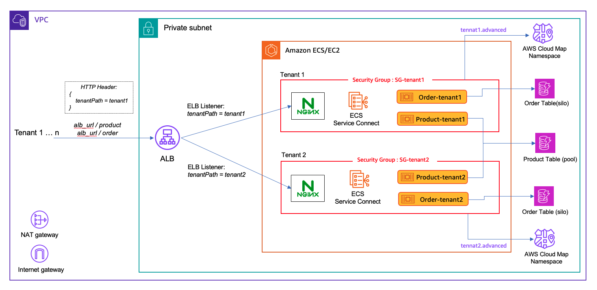
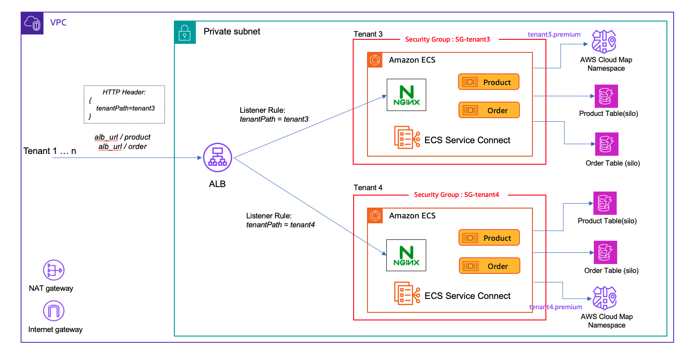

This is the developer documentation of ECS SaaS References architecture. If you want to refer the deployment steps of the solution, pls refer to [this](README.md#deployment-steps) link.

- [Overview](#overview)
- [High Level Architecture](#high-level-architecture)
    * [AWS SaaS Builder Toolkit (SBT)]()
- [Baseline Infrastructure](#baseline-infrastructure-provisioning)
    * [Web Applications](#web-applications)
        + [SaaS Provider Admin Console](#saas-provider-admin-console)
        + [Sample SaaS application](#sample-saas-application)
    * [Application API Layer](#application-api-layer)
        + [Tier-wise API throttling and quota](#tier-wise-api-throttling-and-quota-)
    * [Control plane and Shared Services](#control-plane-and-shared-services-)
        + [Tenant Onboarding](#tenant-onboarding)
        + [Tenant Offboarding](#tenant-offboarding)
        + [User Management](#user-management)
        + [Tenant Management](#tenant-management)
- [Application Plane Architecture](#application-plane-architecture-)
    * [Basic Tier - Shared ECS Services (Pool model)](#basic-tier---shared-ecs-services-pool-model)
    * [Advanced Tier: Shared cluster, dedicated ECS services (Silo model)](#advanced-tier-dedicated-ecs-services-in-a-shard-cluster-per-tenant-silo-model)
    * [Premium Tier: ECS Cluster per tenant (Silo model)](#premium-tier-ecs-cluster-per-tenant-silo-model)
- [Implementing Multi-tenancy in ECS SaaS](#implementing-multi-tenancy-in-ecs-saas-)
    * [Compute Isolation with Amazon ECS](#compute-isolation-with-amazon-ecs-)
    * [Implementing Storage Isolation](#implementing-storage-isolation-)
        + [Data isolation with pooled databases](#1-data-isolation-with-pooled-databases)
        + [Data isolation with silo databases](#2-data-isolation-with-silo-databases)
    * [Scaling the Request Routing of the solution](#scaling-the-request-routing-of-the-solution)
        + [Nginx Routing](#nginx-routing-)
        + [Dedicated ALBs for Premium Tier tenants](#1-dedicated-albs-for-premium-tier-tenants)
        + [Scaling through parallel ALBs](#2-scaling-through-parallel-albs-)
    * [ECS Service discovery](#ecs-service-discovery-)
- [Conclusion](#conclusion)


# Overview
This reference solution provides a sample implementation of architectural best practices in building a multi-tenant SaaS on Amazon Elastic Container Service (ECS). This developer guide will help to understand implementation details of different technical modules and straightedges that this ECS SaaS has leveraged in building multi-tenancy.

We will first understand high level components and the tiering strategy of the solution, and then will dive deeper into the technical implementation of core sections such as SaaS identity, ECS compute isolation strategies, ECS service discovery, data isolation patterns, tier-wise API management, request routing, and handing special concerns such as enforcing security, improving overall scalability and performance of the solution.

(Note that, here our main focus is to help understand building an ECS SaaS within your AWS account, and discussing multi-AWS-account SaaS strategies is out of scope)

# High Level Architecture

The fig 1 shows the high-level architecture of the solution that outlines the core components of ECS SaaS. The solution has three tiers that represents three different tenant isolation strategies using Amazon ECS. This provides SaaS providers broader technical options to model the SaaS solution based on their tiering requirements.

1. Basic Tier: Shared ECS Services across all the tenants ([Pool model](https://docs.aws.amazon.com/wellarchitected/latest/saas-lens/silo-pool-and-bridge-models.html))
2. Advanced Tier : Shared ECS Cluster, dedicated ECS services per tenant (Silo model)
3. Premium Tier: Dedicated ECS Cluster per tenant ([Silo model](https://docs.aws.amazon.com/wellarchitected/latest/saas-lens/silo-pool-and-bridge-models.html))

<p align="center">

Fig 1: ECS SaaS - High-level infrastructure
</p>

Let's go through each component in tails in the following sections, and you will see that we will also discuss strategies we have used to improve the overall multi-tenant experience of the solution and different architectural options that you may consider in building ECS SaaS that are secure and scalable.

Fig 1 illustrates two web applications. These apps will help to interact with the downstream ECS microservices and control plane services to consume the SaaS capacities being provided by this reference solution. More about these apps on [admin console](#saas-provider-admin-console) and [sample saas app](#sample-saas-application).

## SaaS Control plane and AWS SaaS Builder Toolkit (SBT)
The control plane plays a vital role in multi-tenant SaaS solutions that groups shared services of the solution that are used to manage and operate your SaaS environment. This separation of concern allows SaaS providers to build and host these common services independently in teh architecture.

This ECS SaaS reference architecture adopts the latest [AWS SaaS Builder Toolkit](https://github.com/awslabs/sbt-aws) (SBT) that AWS SaaS Factory has developed. SBT is a standalone platform that centrally provides common SaaS control plane shared services out-of-the-box. We have used SBT that help to extend the SaaS control plane services such as tenant onboarding, off-boarding, system user management, etc seamlessly into the ECS SaaS solution with significantly minimised lines of code. It also provides an event-based integration of the control plan to the ECS application plane that enables bi-directional communication for SaaS operations. Read more about AWS SBT [here](https://github.com/awslabs/sbt-aws/blob/main/docs/public/README.md).


## SaaS Application Plane
The SaaS application plane represents business logic, data stores and supporting functionalities that are collectively provide the business functionality of the SaaS solution (e-commerce application). Here you will see there are two tiers in this SaaS solution - Basic tier and Premium Tier that provide different requirements around tenant isolation, resource allocation, security, performance, etc. The idea here is that we will use tiering considerations to illustrate different ECS deployment models and isolation strategies to host the SaaS solution.

The [Basic tier](#basic-tier---shared-ecs-services-pool-model) allows to share the ECS microservices and data stores across all the tenants, while the [Advanced Tier](TODO) provides dedicated ECS services per-tenant basis within a single ECS Cluster. The [Premium tier](#premium-tier-ecs-cluster-per-tenant-silo-model) further provides a silo model where there will be a dedicated cluster and data stores per each Premium tenant. The tenant onboarding module makes sure to look at the tier of the new tenants, and then onboard them  into the right infrastructure model based on above definition. Each tier will implement certain multi-tenancy best practices in order to implement security enforcements which will be described in a later section.

Core Utils section is an extension of AWS SBT that represents the supportive functions of the application plane that are getting triggered via EventBride events initiated from relevant control plane activities in SBT. For example, the AWS CodePipeline that has been implemented as a part of the SaaS application plane will hav the AWS CDK scripts to create new infrastructure and configurations for tier-based tenant onboarding. It will be triggered from the Tenant Onboarding microservice that belongs to the SBT when a new tenant is being onboarded in the solution.

# Baseline Infrastructure Provisioning
The instructions in the [deployment steps](README.md#deployment-steps) would allow you to install the baseline infrastructure of this solution architecture. The baseline resources represent those elements of the architecture, that establish the foundation of our environment before any tenants are onboarded into the system. Figure 2 provides a high-level representation of the architecture deployed as part of baseline infrastructure.

<p align="center">
Fig 2: Baseline infrastructure
</p>

Below are the details of AWS resources and architectural components that are deployed as part of the baseline infrastructure.

## Web Applications

The two web apps deployed in the solution will help you to interact with the downstream ECS microservices and control plane services to consume the SaaS capacities being provided by this reference solution. Both of these web applications are built with AngularJS and their static content are hosted on CloudFront and S3.


### SaaS Provider Admin Console

The "SaaS provider admin console" represents an application that is used by the administrators of a SaaS provider. Typically, SaaS Provider admins can use this portal and perform operations, such as, provisioning a new tenant, updating an existing tenant, and adding/updating system users in the solution. In the ECS SaaS we have leveraged only tenant onboarding. We have provisioned an admin user as part of baseline infrastructure, using the email address provided as part of the deployment of the solution. The system sends an email with the username and password information for the admin user, once created. You should be able to use this information to login into the admin interface to explore it further. Administrative users are authenticated by Amazon Cognito, using a user pool that is specifically created for them.

### Sample SaaS application

This is a sample e-commerce application that we consider as the actual SaaS solution that you want to sell to your customers (tenants). Depending on the tier, this solution architecture deploy this e-commerce application in two different models that have unique tenant isolation strategies. This app requires users to sign-in to access its features. Like in a typical SaaS, the tenant admins can use this application to create new users within their organization. This application includes minimal functionality to simulate its features, allowing you to create/update products and orders.

As mentioned above, we have followed a tiered deployment model. Our SaaS application asks for tenant name as part of sign-in process. The user is then redirected to the relevant Cognito hosted UI where you can provide user name and password to sign-in.

Once authenticated, the SaaS app illustrates the interaction with two multi-tenant microservices in the solution: product and order. The idea here is that each tenant can add some number of products, which then serve as line items in a subsequent tenant order.

You can use the tenant admin user created during sign-up process to login into this application. You can also create more users inside your tenancy, as needed.

## Application API Layer

The application and shared services of the ECS SaaS environment are accessed through a central API in Amazon API Gateway. The baseline infrastructure creates the resources, methods, and lambda functions necessary to create and deploy our microservices. There are 3 API resources are being created as a part of the baseline infrastructure as follows.
1. /orders - CRUD operations for order microservice
2. /products - CRUD operations for product microservice
3. /users - CRUD operations for managing tenant-wise users to be accessed by Tenant admins

Each request coming to these API resources will undergo for two verification steps
1. Connect with a Lambda authorizer that will centrally cross-check the validity of the API request based on the authorization details (JWT token) and extract tenant identity (tenant Id) of the request.
2. API Gateway will execute the Usage plans to validate the API throttling settings (API rate, burst and quota) allocated based on the tier of the tenant

Upon successful validation of both steps, the requests will be connected to the downstream ECS microservices via a API Gateway HTTP integration. This integration happens from API resource to a private Network Load Balancer in the solution. This NLB will direct the traffic to central Application Load Balancer that will route the requests to the right tenant in the tier.


### Tier-wise API throttling and quota

API throttling is a common technique that helps to protect multi-tenant SaaS solutions from API spikes from legitimate inbound traffic from tenants. These spikes can lead to compromise  the reliability and performance of the SaaS by impacting to the throughput of the solution. A common scenario that each SaaS need to handle is noisy neighbors - who are tenants that can get busy unexpectedly leading to API spikes and unnecessary resource utilization at downstream. Amazon API Gateway provides in-built constructs such as [Usage plans](https://docs.aws.amazon.com/apigateway/latest/developerguide/api-gateway-api-usage-plans.html) and [API Keys](https://docs.aws.amazon.com/apigateway/latest/developerguide/api-gateway-basic-concept.html#apigateway-definition-api-key) that help to control this scenario.

Throttling is usually part of a broader tiering strategy where basic tier tenants, for example, have throttling policies that limit their ability to impact the experience of higher tier tenants. In this ECS SaaS reference solution, we have leveraged tier-based API throttling and quota experience targeting to handle above noisy neighbor issue.

There is a tier specific usage plan that specifies API rate, burst and quota. The idea here is that higher tiers in the SaaS such as Premium tier will have better allocation of these items compared to the lower tiers such as Basic tier. The base infrastructure creates two Usage plans for the two tiers we have in the solution, and we have associated the API keys with these usage plans to ensure tenant level throttling limits.

Depending upon your scenario, you might consider having one usage plan per tenant as well. This is usually the case when you have limited number of tenants. In this case, your registration and provisioning service would have to create the API key and usage plan during tenant onboarding.

## Control plane and Shared Services

As mentioned [above](#saas-control-plane-and-aws-saas-builder-toolkit-sbt), we have leveraged AWS SBT as the core platform that helps to provide the complete control plane and the shared services for the ECS SaaS reference solution. While SBT provides a broader range of foundational shared service capabilities, in here, we're using microservices for Tenant Registration, Tenant Provisioning, Tenant Management and User Management from SBT.

Let's dive into the details of these microservices, one at a time.

### Tenant Onboarding
Tenant Onboarding service allows to add new tenants in the reference solution. Tenant onboarding microservice is responsible for orchestrating interactions with user management, tenant management and infrastructure provisioning (for Platinum tenants) to make the new tenant ready for its users to consume.

### Tenant Offboarding
This is a quite important functionality that control plane handles, that provides an API to remove the tenants in the solution. In real life, the use-case to use this feature would be when you want to  remove a tenant from the SaaS due to a churn. It will make sure not only to remove entries from the data stores, but also de-provision tenant specific infrastructure of the new tenant, to save unnecessary cost.

### User Management
This shared Service is used to manage SaaS admin users. It allows to add, update, disable and get users. It also allows to get all users, disable all users, and enable all users by tenant. The users, in this scenario, will be stored in Amazon Cognito.

### Tenant Management
The Tenant Management service centralizes all of the configuration and operations that can be performed on a tenant. This includes get, create, update, activate, and disable tenant functionality. Tenant details are stored inside an Amazon DynamoDB table.

## SaaS Application plane
Essentially, the SaaS application plane contains all the resources, configs and data stores that will form tier-based SaaS architecture patterns in the ECS SaaS solution. There are two parts here: core utilities that will integrate to the control plane, and the ECS application serves. In the baseline infrastructure, we will only deploy Basic tier resources that are shared (pooled) across all the tenants, while the Premium tier resources will be dynamically created in the application plan as and when the Premium tenants are onboarded to the solution. Therefore, there will be an ECS cluster with product and order microservice and their DynamoDB tables will be created in the application plane during base infrastructure deployment. Refer the section [Basic Tier](#basic-tier---shared-ecs-services-pool-model) for detailed technical deep dive about the Basic tier architecture and it's multi-tenant behavior.

### Core Utils
There are different types of implementation modules that are required, which will be working hand-in-hand SBT control plane events in order to provide the correct integration in the application plane. These modules are commonly called Core utils in the ESC SaaS baseline architecture, which provide the life to cross-cutting shared service such as tenant onboarding, user management, manage tiering etc. You may find more details about this module form [SBT documentation](https://github.com/awslabs/sbt-aws/tree/main/docs/public#core-application-plane-utilities).

One of the main core-utils we have implemented here is the AWS CodePipeline that helps to build/update the ECS microservices on-demand, and which provide the automation for onboarding of new tenants.


#  Application Plane Architecture

Following diagram provides a deeper technical view of the reference architecture with all the tiers and with sample tenants onboarded into each tier.

<p align="center">
Fig 3: Solution Architecture - Application Plane Services with Tiers 
</p>

There are many AWS constructs have been used in order to implement the multi-tenancy aspect of the ECS SaaS solution at the application layer. We will explore each tier separately with deeper details, before that, lets checkout some of the important AWS components that we are going to use in this ECS SaaS solution as follows.

1. Amazon API Gateway - implements API authorisation (using a Lambda authorizer), throttling and quotas using Usage plans and API keys as described [here](#api-authorization-and-tenant-isolation)
2. VPC Security Groups - helps to isolate compute resources / ECS Services to implement the compute tenant isolation. This allows to preserve the network level compute tenant isolation. More details [here](#implementing-multi-tenancy-in-ecs-saas-)
3. AWS Application Load Balancer – Centrally handles the request routing to the tenants that have been onboarded in different tiers. There are scalable routing options with ALBs to discuss that supports large no of tenants which has been explained under Strategies for Scaling API Routing
4. Nginx – acts as a reverse-proxy that manages ECS microservice endpoints that will help to route API requests to the right ECS services in the Premium tier. More details [here](#nginx-routing-)
5. ECS Service Connect – provides the service discovery capability to route requests to ECS microservices and to facilitate potential inter microservice communication within the cluster. More details [here](#ecs-service-discovery-)
6. AWS CloudMap – helps to maintain the updated metadata of ECS services dynamically that enables the service discovery
7. [awsvpc](https://docs.aws.amazon.com/AmazonECS/latest/developerguide/task-networking-awsvpc.html) network mode – the preferred network model to run ECS services in this reference architecture. With this, Amazon ECS creates and manages an Elastic Network Interface (ENI) for each task and each task receives its own private IP address within the VPC including when instance is running multiple tasks. It will also allow to increase overall no of ENIs attached per EC2 in the cluster using ENI trunking

##  Basic Tier - Shared ECS Services (Pool model)

The Basic tier represents an all-shared implementation. Here, all microservices and underlying storage components are shared across all the tenants. Given this nature, this architecture is scalable for serving a large number of tenants within the tier, so SaaS providers can also refer this to implement Free of Freemium tiers in their SaaS solutions.

Because of this pooled implementation, the compute workload in this tier would become very dynamic when increasing number of tenants, and so the ECS cluster would need to handle it seamlessly with right sized autoscaling to optimize the overall ECS cost. Here, the reference architecture provides code and configurations needed to implement ECS cluster on [AWS Fargate](https://aws.amazon.com/fargate/) - Serverless compute engine, to provide additional operational efficiency to the tier where SaaS providers will not need to manage the underneath compute. This could also help for optimized economy of scale for large number of tenants long term. However, SaaS providers should pick the right compute hosting mode (EC2 or Fargate) to run ECS workload based on the nature of the use-case, number of tenants expected, resource utilization of the microservices, etc.

<p align="center">
Fig 4: Basic Tier Architecture 
</p>


This tier will be preloaded in the solution as a part of the baseline architecture. The product and order microservices have their own ECS task definition created so they can have their own task configurations. Each microservice is attached to a Cloud Map namespace (services.pool) to enable service discovery.

Each Basic tier tenant will connect to the ALB with a common HTTP header “tenantPath = basic”, which will be evaluated by the ALB and then traffic will be routed to the microservices.

From the data isolation standpoint, this model shares both Product and Order tables across all tenants, and implements fine-grained access control using dynamic IAM policies at runtime for tenant specific DB operations, (refer [here](#1-data-isolation-with-pooled-databases)).

## Advanced Tier: Dedicated ECS services in a shard Cluster per tenant (Silo model)
This allows SaaS providers to allocate dedicated ECS services per tenant within a shared ECS cluster, allowing to share the ECS compute capacity in the cluster across all the tenants. This could help improving overall cost efficiency and economy of scale of the compute layer when increasing the number of tenants.

<p align="center">
Fig 5: Advanced Tier Architecture 
</p>


Here, the same ECS Task definitions will be redeployed per tenant basis to create dedicated microservices and assign them into an own Cloud Map namespace to enable service discovery for ECS Service Connect.

Each tenant has a Security group which each service of the tenant is attached to. Traffic controlling is implemented in a way that Security group only accepts the incoming traffic from tenant users via ALB and traffic from services within the same Security Group, so the compute tenant Isolation is preserved, (refer [here](#compute-isolation-with-amazon-ecs)).

In order to handle request routing at scale, we have leveraged a custom routing mechanism with Nginx, that routes to ECS services of the same tenants, (refer [here](#nginx-routing)).

The storage layer of this tier will follow a bridge model where product datab tables are shared across tenants while order tables will be silos. Shared data access is isolated using fine grained access control and the silo data access is protected by the tenant specific IAM role being injected as the ECS Task role which is explained [here](#2-data-isolation-with-silo-databases).

## Premium Tier: ECS Cluster per tenant (Silo model)
This tier dedicates silo AWS components, where there will be a ECS cluster with own microservices and own databases per-tenant basis.

<p align="center">
Fig 6: Premium Tier Architecture 
</p>

In order to provide better infrastructure isolation for their tenants, SaaS providers can refer to the Premium Tier implementation where we discuss a model with ECS cluster per tenant. Here, the microservices will be deployed in a new ECS cluster powered by ECS Service connect during tenant onboarding. Which means that each tenant will have their own EC2 capacity underneath which will enhance the overall resilience and reliability of the compute layer with reduced blast radius tenant-wise, which would be the key benefit for the SaaS providers in this model as opposed to the other tiers.

There will be dedicated Nginx service per cluster that will handle the service routing along with ECS service connect that will use a dedicated Cloud Map namespace for service discovery as explained [here](#ecs-service-discovery). Each tenant will be equipped with silo data resources here and data isolation is secured via the ECS Task role.

# Implementing Multi-tenancy in ECS SaaS
Now let's dive deeper into the implementation details of multi-tenant strategies we have leveraged in this reference solution. We will discuss tenant isolation implemented at the application plane of ECS SaaS in terms of compute and storage.

## Compute Isolation with Amazon ECS
The main AWS construct to use in implementing the compute level isolation in ECS is the VPC Security Groups. The idea is that each tenant will have a dedicated Security Group to where we attach all the services of the tenant. Traffic controlling is implemented in a way that Security group only accepts the incoming traffic from tenant users from the ALB (that makes sure to filter the traffic by tenant Id) and traffic from services within the same Security Group to facilitate. Inter service communication. This prevents the network communication of microservices each other across tenants, hence the compute isolation is preserved.

[`ecs-cluster.ts`](./server/lib/tenant-template/ecs-cluster.ts) contains the sample implementation of this mechanism as follows. First, we will create AWS VCP security group and restrict the network traffic in a way that it will allow the requests only form ALB and the backend services of the same cluster as follows.

```typescript
this.ecsSG = new ec2.SecurityGroup(this, "ecsSG", {
    vpc: this.vpc,
    allowAllOutbound: true,
});
this.ecsSG.connections.allowFrom( this.albSG, ec2.Port.tcp(80),"Application Load Balancer" );
this.ecsSG.connections.allowFrom( this.ecsSG, ec2.Port.tcp(3010),"Backend Micrioservice" );


```

Then, we assign this security group as a Service property when the ECS service is created. In the following code, `service` refers to the microservice (product or order) that we create per tenant basis, and `serviceProps` variable is used to hold the properties including the `securityGroups` attached to the ECS task.

```typescript

const serviceProps = {
    cluster,
    desiredCount: 2,
    taskDefinition,
    securityGroups: [this.ecsSG],
    serviceConnectConfiguration: {
        logDriver: ecs.LogDrivers.awsLogs({
            streamPrefix: `${info.name}-sc-traffic-`,
        }),
        namespace: cluster.defaultCloudMapNamespace?.namespaceArn,
        services: [
            {
                portMappingName: info.name,
                dnsName: `${info.name}-api.${props.stageName}.sc`,
                port: info.containerPort,
                discoveryName: `${info.name}-api`,
            },
        ],
    },
};

let service = null;
if(this.isEc2Tier) {
    service = new ecs.Ec2Service(this, `${info.name}-service${index}`,serviceProps);
} else {
    service = new ecs.FargateService(this, `${info.name}-service${index}`,serviceProps);
}

```
## Implementing Storage Isolation
The implementation of multi-tenant storage strategies in SaaS solutions are heavily driven by the underlying storage technology being used. In order to provide a comprehensive overview storage isolation, we have used Amazon DynammoDB tables in our ECS SaaS reference architecture. Let's discuss different storage strategies that we can implement with Amazon ECS microservices leveraging IAM policies that can prevent one tenant  accessing the data of other tenants. There are two main scenarios here.

### 1. Data isolation with pooled databases
When a DynamoDB table is shared across multiple tenants, we would leverage fine-grained access control with IAM policies. Here, the ECS microservices creates a DynamoDB client-connection which provides a scoped-access to the shared table using a dynamically generated IAM policy with tenant-context. Using this connection, the microservice ensures that each tenant will have the access to their own dataset to conduct DB operations preventing cross-tenant data access. Following is the IAM policy we are using in the reference solution which will be converted into tenant-specific policy by replacing the placeholders `table` and `tenant` with the relevant values. Then we leverage AWS Security Token Service to convert this tenant specific policy into short living creadentials, that will be used to create the DDB connection we discussed above. And, that connection prevents the cross tenant DB access. More on this mechanism can be found from [here](https://github.com/aws-samples/aws-saas-factory-dynamodb-fine-grained-access-control-for-saas).

```json
{
  "Version": "2012-10-17",
  "Statement": [
    {
      "Effect": "Allow",
      "Action": ["dynamodb:*"],
      "Resource": ["arn:aws:dynamodb:*:*:table/{{table}}"],
      "Condition": {
        "ForAllValues:StringEquals": {
          "dynamodb:LeadingKeys": ["{{tenant}}"]
        }
      }
    }
  ]
}
```

### 2. Data isolation with silo databases
When each tenant is having their own DynamoDB tables, we just need to inject the right IAM credentials for each microservice that can be used to connect to the right tenant-specific DynamoDB table.This IAM policy would look like as follows that specifies the least privileged access that the ECS Service need to have to connect conduct DB operations on the table specificed by `<TABLE_ARN>`.

```json
{
  "Version": "2012-10-17",
  "Statement": [
    {
      "Action": [
        "dynamodb:GetItem", "dynamodb:PutItem", "dynamodb:BatchGetItem", "dynamodb:Query", "dynamodb:Scan", "dynamodb:BatchWriteItem", "dynamodb:UpdateItem", "dynamodb:GetRecords"
      ],
      "Resource": "<TABLE_ARN>",
      "Effect": "Allow"
    }
  ]
}
```
It's also important to discuss how we can inject these IM policies in a seamless manner in an ECS service. For that we are leveraging the [ECS Task Role](https://docs.aws.amazon.com/AmazonECS/latest/developerguide/task-iam-roles.html). The idea here is that we generate this IAM policy and attach that as a part of the task role when the task definition of the ECS microservice is created as follows. Then, when the ECS Service is created, the given policy is inherited to the microservice to be used to connect to the right resource and perform permitted DB operations.
```typescript
let policy = JSON.stringify(DDBPolicyDocument);
const policyDocument = iam.PolicyDocument.fromJson(JSON.parse(policy));

const taskRole = new iam.Role(this, `${info.name}-ecsTaskRole`, {
    assumedBy: new iam.ServicePrincipal('ecs-tasks.amazonaws.com'),
    inlinePolicies: {
        EcsContainerInlinePolicy: policyDocument,
    },
});

taskRole.addManagedPolicy(iam.ManagedPolicy.fromAwsManagedPolicyName('service-role/AmazonEC2ContainerServiceforEC2Role'));

let taskDefinition = null;
if(this.isEc2Tier) { //ec2
    taskDefinition = new ecs.Ec2TaskDefinition(this, `${info.name}-TaskDef`, {
        executionRole: taskExecutionRole,
        taskRole: taskRole,
        networkMode:ecs.NetworkMode.AWS_VPC,
    });
} else { //fargate
    taskDefinition = new ecs.FargateTaskDefinition(this, `${info.name}-TaskDef`, {
        memoryLimitMiB: info.memoryLimitMiB,
        cpu: info.cpu,
        executionRole: taskExecutionRole,
        taskRole: taskRole,
    });
}
```

## Scaling the Request Routing of the solution
In the ECS SaaS reference architecture, tenant routing is a critical functionality and, often there are many moving parts in involved in here. Even though the reference architecture provides the routing for all the tenants of all tiers via a central ALB, we will often need to consider scaling the request routing in the solution.

### Nginx Routing
If we look at a lifecycle of an API request reaching the ECS Cluster, primarily there are 2 main filtering to be done. Firstly, the we should identify the tenant / tier of the request, this is done by AWS ALB that has been setup in the architecture. Then we need a mechanism to route the request to the relevant ECS microservice within the ECS Cluster. In fact, we can perform both filtering in the same ELB Listener, however then, we will need to allocate a dedicated TargetGroup per microservice per tenant - which will lead to overwhelm the usage of limited security groups in a given ALB. As a solution in this solution architecture, we have leveraged Nginx as a reverse-proxy that would help to conduct ECS microservice level routing.

Ningx manages the microservice endpoints and maps them to the relevant ECS Service connect proxy pass of the relevant ECS service that is running in the cluster. In the following example the proxy_pass stands for the unique URI given for the ECS Service connect proxy of the Order microservice.

```shell
    location ~ ^/orders {
      if ($request_method !~ ^(GET|POST|HEAD|OPTIONS|PUT|DELETE)$) {
        return 405;
      }
      proxy_pass http://orders-api.prod.sc:3010;
      proxy_http_version 1.1;
      proxy_set_header Upgrade $http_upgrade;
      proxy_set_header Connection 'upgrade';
      proxy_set_header Host $host;
    }
```


In this ECS SaaS reference solution, we have used the ALB to be shared across all the tenants in the tiers. If you are expecting to have a large number of tenants in the SaaS solution, you may want to evaluate more scalable mechanisms to extend the request routing architecture. Let's discuss a couple of strategies that help to scale the overall routing capabilities in ECS SaaS for making the overall solution architecture more robust.

### 1. Dedicated ALBs for Premium Tier tenants
The premium tenants usually demand dedicated infrastructure in order to reduce cross tenant influence and leverage better tenant isolation, where an ALB per tenant can be allocated as shown in the following diagram. Given there are less than 100 microservices in the SaaS, an ALB itself can route requests for the microservices using target groups without any Nginx components allowing the SaaS providers to have a full-stack isolation with native AWS services. The flip side would be the additional infrastructure (ie NLB) required to connect the ALBs to the API Gateway and extra cost involved in this setup.


<p align="center">
Fig 7: Premium tier routing at scale with dedicated ALBs 
</p>


### 2. Scaling through parallel ALBs
A single ALB will route the request to max 100 tenants irrespective of if it is advanced tier (Services per tenant) or Premium tier (Cluster per tenant). To facilitate this, there will be a dedicated REST API resources per ALB that serves the requests for given 100 tenants. So, this APIGW endpoint URL is now tenant-specific and it will be saved against the tenant Id during tenant onboarding flow in the tenant management data table, and then will be passed to the front-end client app when a particular user logs in, so the front-end will use it to access the downstream microservices via the right APIGW → ALB → ECS cluster/services.


<p align="center">
Fig 8: Scaling the routing using parallel ALBs 
</p>


## ECS Service discovery
Amazon ECS Service Connect provides management of service communication within Amazon ECS clusters with the help of service discovery. In order to maintain the map of the ECS services being created in a given cluster, we would add a AWS Cloud Map namespace. So ideally, an ECS cluster will have a dedicated Cloud Map, in which the metadata of the ECS services and resources are maintained at real time. ECS Service connect will make sure of these details in the namespace in order to route the requests to the correct ECS service in the cluster.

The main purpose of ECS Service connect is to provide the routing capability along with [Niginx](#nginx-routing-) for incoming requests, and facilitate the inter-microservice communication within the cluster. When an ECS cluster is created with Service Connect enabled, each ECS service will be running in a way that each task in the service will have their own Service Connect agent as shown in the following diagram that enables the request routing.


<p align="center">
Fig 9: API Request workflow with ECS Service connect 
</p>


Here, the ALB directs the incoming requests from tenant1 users to the registered Target Group where the Nginx Service is hosted, and so the Service connect agent of the Nginx service will manage the requests. Based on the microservice endpoint that was requested, Nginx will request its agent to route to the request to the relevant ECS Service. Service connect will then identify the agent of the ECS service and direct the request through its agent. Service Connect leverages the service discovery via the entries in the Cloud Map namespaces where all the services of the cluster has been registered.


# Conclusion
This developer guide provided the technical details of the core components of the ECS SaaS Reference architecture. We discussed overall ECS solution architecture, tiring strategy, different strategies used  to implement tenant isolation with Amazon ECS, data isolation mechanisms, and deep dive into how ECS services discovery API throttling, and request routing at scale.

We would encourage you to clone the github codebase and have a walk-through to understand the implementation of these components. Also, feel free to provide feedback about the reference solution and send us the feature requests if you wish to contribute, which will help us to improve this solution continuously. We expect to continue to make enhancements to the solution and address new strategies as they emerge.
