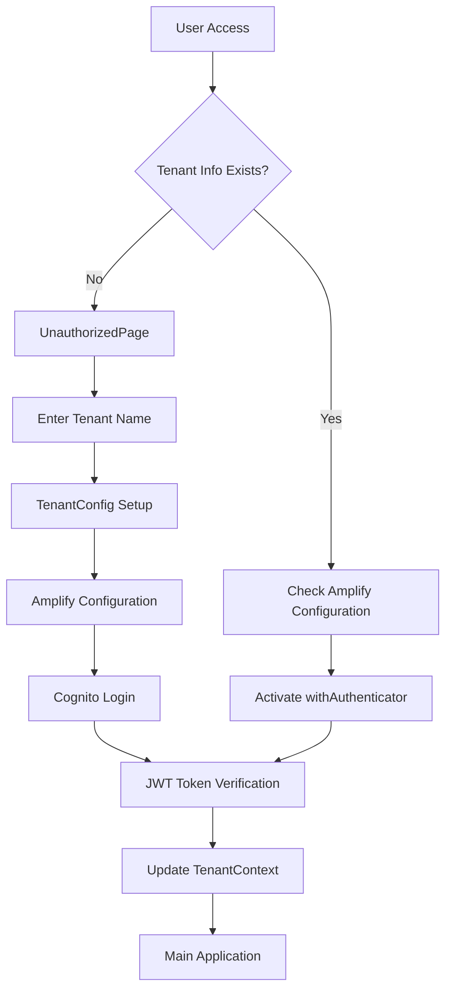
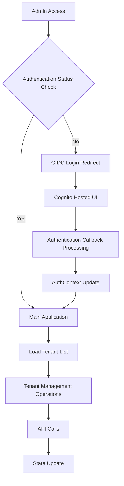
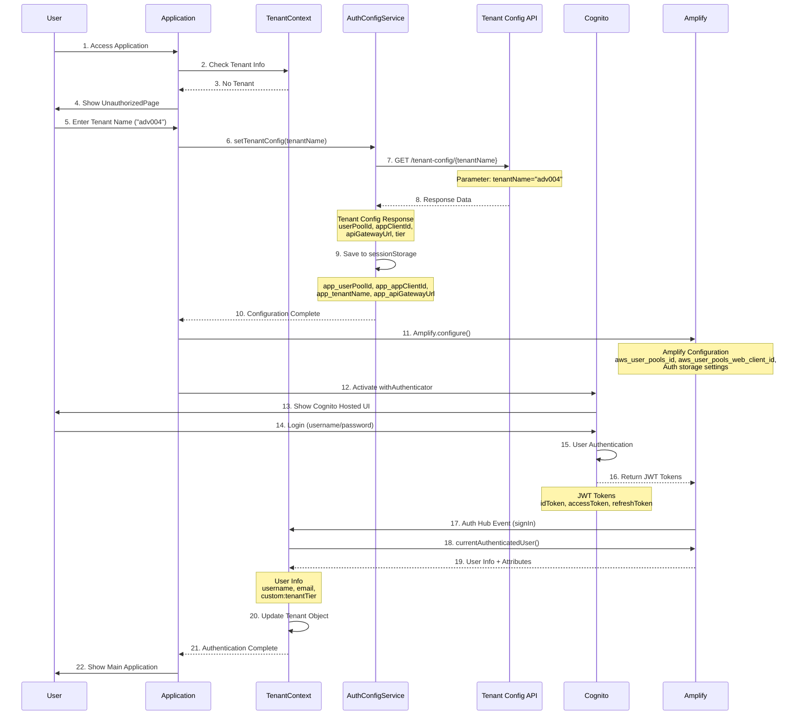
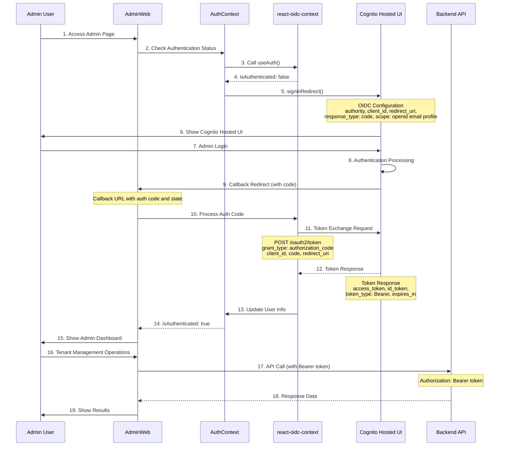
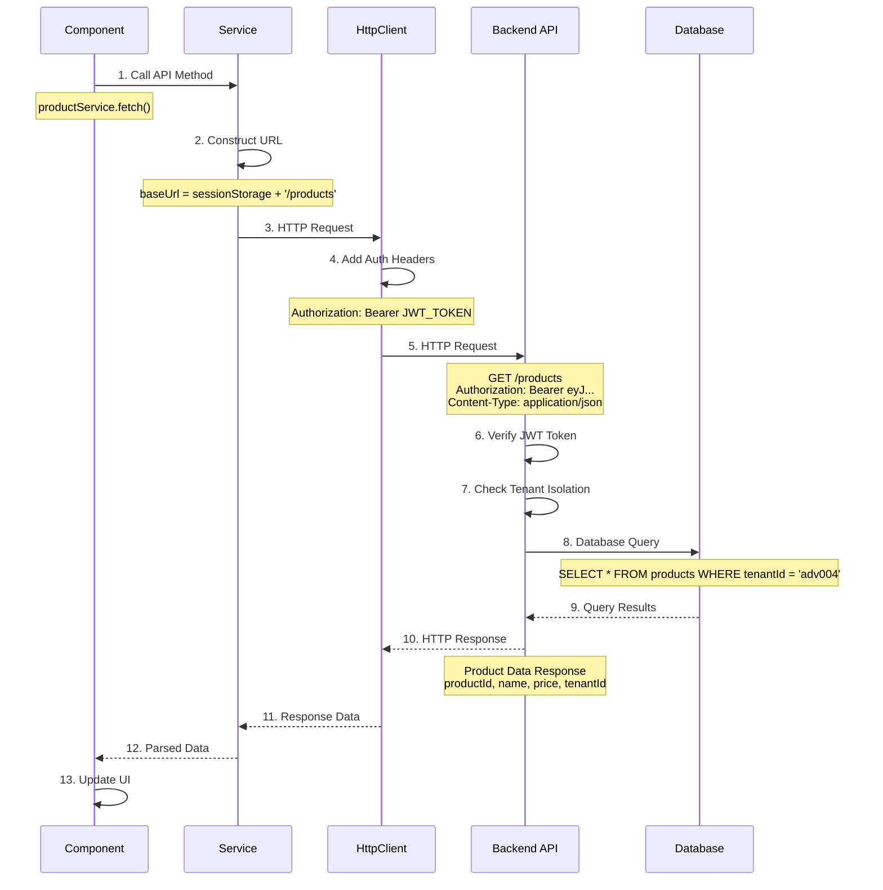

# React SaaS Architecture Analysis

## Overview

This document analyzes the structure and operational flow of two React-based web applications (`Application` and `AdminWeb`) in the ECS SaaS Reference Architecture.

## Project Structure

```
client/
├── Application/          # Tenant user application
└── AdminWeb/            # System administrator application
```

---

## 1. Application (For Tenant Users)

### 1.1 Project Structure

```
Application/
├── public/
├── src/
│   ├── components/
│   │   └── Layout/           # Layout components
│   ├── contexts/
│   │   └── TenantContext.tsx # Tenant state management
│   ├── pages/
│   │   ├── Dashboard/        # Dashboard
│   │   ├── Products/         # Product management
│   │   ├── Orders/           # Order management
│   │   ├── Users/            # User management
│   │   ├── Auth/             # Authentication info
│   │   └── Error/            # Error pages
│   ├── services/
│   │   ├── authConfigService.ts  # Authentication configuration
│   │   ├── productService.ts     # Product API
│   │   ├── orderService.ts       # Order API
│   │   └── userService.ts        # User API
│   ├── hooks/                # Custom hooks
│   ├── types/                # TypeScript type definitions
│   ├── constants/            # Constants
│   └── App.tsx              # Main app component
├── package.json
└── tsconfig.json
```

### 1.2 Core Features

#### Authentication System
- **AWS Amplify + Cognito** based authentication
- **withAuthenticator** HOC usage
- Extract `custom:tenantTier` from JWT token
- Tenant-isolated authentication

#### Tenant Management
- Global tenant state management via **TenantContext**
- sessionStorage-based tenant information storage
- Dynamic Amplify configuration (tenant-specific User Pool)

#### Main Pages
1. **Dashboard**: Tenant information and tier display
2. **Products**: Product CRUD operations
3. **Orders**: Order creation and management
4. **Users**: User management
5. **Auth Info**: JWT token debugging information

### 1.3 Operational Flow



### 1.4 State Management

#### TenantContext
```typescript
interface Tenant {
  id: string;
  name: string;
  tier?: string;
}

interface TenantContextType {
  tenant: Tenant | null;
  setTenant: (tenant: Tenant | null) => void;
  loading: boolean;
  setTenantConfig: (tenantName: string) => Promise<string>;
}
```

#### Key Features
- React Context API usage
- sessionStorage-based persistence
- Real-time tier information updates via Auth Hub listener

---

## 2. AdminWeb (For System Administrators)

### 2.1 Project Structure

```
AdminWeb/
├── public/
├── src/
│   ├── components/
│   │   ├── Layout/           # Layout components
│   │   ├── Auth/             # Authentication components
│   │   └── common/           # Common components
│   ├── contexts/
│   │   └── AuthContext.tsx   # Authentication state management
│   ├── pages/
│   │   ├── Dashboard/        # Dashboard
│   │   ├── Tenants/          # Tenant management
│   │   └── Auth/             # Authentication info
│   ├── services/
│   │   ├── api.ts            # API client
│   │   └── tenantService.ts  # Tenant API
│   ├── hooks/
│   │   └── useTenants.ts     # Tenant management hook
│   ├── models/               # Data models
│   ├── constants/            # Constants
│   └── App.tsx              # Main app component
├── package.json
└── tsconfig.json
```

### 2.2 Core Features

#### Authentication System
- **react-oidc-context** based OIDC authentication
- Cognito Hosted UI usage
- Automatic token renewal and error handling

#### Tenant Management
- Tenant creation, retrieval, deletion
- Tier-based pricing management (BASIC, ADVANCED, PREMIUM)
- Federation configuration support

#### Main Pages
1. **Dashboard**: System overview
2. **Tenant List**: All tenant listings
3. **Tenant Create**: New tenant onboarding
4. **Tenant Detail**: Tenant details and deletion

### 2.3 Operational Flow



### 2.4 State Management

#### AuthContext
```typescript
interface AuthContextType {
  user: User | null | undefined;
  isAuthenticated: boolean;
  isLoading: boolean;
  error: any;
  login: () => void;
  logout: () => void;
  getAccessToken: () => string | undefined;
  clearError: () => void;
}
```

#### useTenants Hook
```typescript
interface UseTenants {
  tenants: Tenant[];
  loading: boolean;
  error: string | null;
  loadTenants: () => Promise<void>;
  deleteTenant: (tenant: Tenant) => Promise<void>;
}
```

---

## 3. Common Architecture Patterns

### 3.1 Folder Structure Patterns
- **pages/**: Route-specific page components
- **components/**: Reusable UI components
- **contexts/**: React Context-based state management
- **services/**: API communication logic
- **hooks/**: Custom hooks
- **types/models/**: TypeScript type definitions
- **constants/**: Constants and configurations

### 3.2 State Management Patterns
- **React Context API**: Global state management
- **Custom Hooks**: Business logic separation
- **Local State**: Component-specific state

### 3.3 API Communication Patterns
- **Service Layer**: API call logic separation
- **Error Handling**: Centralized error processing
- **Token Management**: Automatic token injection

### 3.4 Routing Patterns
- **React Router v6**: Declarative routing
- **Protected Routes**: Authentication-based route protection
- **Nested Routes**: Hierarchical route structure

---

## 4. Technology Stack Comparison

| Category | Application | AdminWeb |
|----------|-------------|----------|
| **Authentication** | AWS Amplify + Cognito | react-oidc-context |
| **State Management** | Context API | Context API + Custom Hooks |
| **UI Library** | Material-UI | Material-UI |
| **Routing** | React Router v6 | React Router v6 |
| **HTTP Client** | fetch (built-in) | axios |
| **TypeScript** | ✅ | ✅ |

---

## 5. Security Considerations

### 5.1 Application
- JWT token-based authentication
- Tenant-isolated data access
- sessionStorage usage (XSS prevention)
- HTTPS enforcement

### 5.2 AdminWeb
- OIDC standard compliance
- Automatic token renewal
- CSRF protection
- Administrator privilege verification

---

## 6. Performance Optimization

### 6.1 Bundle Size
- **Application**: ~353KB (gzipped)
- **AdminWeb**: ~177KB (gzipped)

### 6.2 Optimization Techniques
- Code Splitting (React.lazy)
- Tree Shaking
- Image optimization
- Memoization (useMemo, useCallback)

---

## 7. Deployment and Operations

### 7.1 Build Configuration
- Create React App based
- TypeScript compilation
- ESLint + Prettier
- Environment-specific configuration separation

### 7.2 Docker Support
- Nginx-based static file serving
- Multi-stage builds
- Environment variable injection

---

## 8. Improvement Suggestions

### 8.1 Short-term Improvements
- React Query/SWR adoption (caching and synchronization)
- Error Boundary addition
- Loading state improvements
- Accessibility (a11y) enhancements

### 8.2 Long-term Improvements
- Micro Frontend architecture review
- PWA feature addition
- Real-time notification system
- Multi-language support

---

## Conclusion

Both React applications are well-designed for their respective purposes and follow modern React development patterns. Particularly well-implemented are state management using Context API, business logic separation through custom hooks, and type safety through TypeScript.

While the authentication methods and state management patterns differ between applications, these appear to be optimized choices for their respective use cases.

---

## 9. Cognito Authentication Process Detailed Analysis

### 9.1 Application (AWS Amplify + Cognito)

#### Authentication Flow Diagram


#### Key Parameters and Results

**1. Tenant Config API Call**
```typescript
// Request
GET /tenant-config/adv004

// Response
{
  "userPoolId": "ap-northeast-2_znj5rT26i",
  "appClientId": "6v1015kujbpmp5k0r4r167ud3f", 
  "apiGatewayUrl": "https://1ygh9dyq7b.execute-api.ap-northeast-2.amazonaws.com/prod/",
  "tier": "ADVANCED"
}
```

**2. Amplify Configuration**
```typescript
{
  aws_project_region: "ap-northeast-2",
  aws_cognito_region: "ap-northeast-2",
  aws_user_pools_id: "ap-northeast-2_znj5rT26i",
  aws_user_pools_web_client_id: "6v1015kujbpmp5k0r4r167ud3f",
  Auth: {
    storage: sessionStorage
  }
}
```

**3. Cognito JWT Token Structure**
```typescript
// ID Token Payload
{
  "sub": "user-uuid",
  "email": "user@adv004.com",
  "email_verified": true,
  "custom:tenantTier": "ADVANCED",
  "cognito:username": "user123",
  "aud": "6v1015kujbpmp5k0r4r167ud3f",
  "iss": "https://cognito-idp.ap-northeast-2.amazonaws.com/ap-northeast-2_znj5rT26i"
}
```

### 9.2 AdminWeb (OIDC + Cognito)

#### Authentication Flow Diagram


#### OIDC Configuration Parameters
```typescript
// environment.ts
export const oidcConfig = {
  authority: "https://cognito-idp.ap-northeast-2.amazonaws.com/ap-northeast-2_userPoolId",
  client_id: "adminAppClientId",
  redirect_uri: `${window.location.origin}`,
  response_type: "code",
  scope: "openid email profile",
  post_logout_redirect_uri: `${window.location.origin}`
};
```

---

## 10. Backend REST API Call Analysis

### 10.1 Application API Call Structure

#### HTTP Client Configuration
```typescript
// httpClient.ts
class HttpClient {
  private getAuthHeaders(): Record<string, string> {
    const user = getCurrentUser();
    if (user?.signInUserSession) {
      return {
        'Authorization': `Bearer ${user.signInUserSession.accessToken.jwtToken}`,
        'Content-Type': 'application/json'
      };
    }
    return { 'Content-Type': 'application/json' };
  }

  async get<T>(url: string): Promise<AxiosResponse<T>> {
    return axios.get(url, { headers: this.getAuthHeaders() });
  }
}
```

#### API Service Endpoints

**1. Product Service**
```typescript
// productService.ts
class ProductService {
  private get baseUrl(): string {
    return `${sessionStorage.getItem('app_apiGatewayUrl')}/products`;
  }

  // GET /products
  async fetch(): Promise<Product[]> {
    const response = await httpClient.get<Product[]>(this.baseUrl);
    return response.data;
  }

  // POST /products
  async create(product: CreateProductRequest): Promise<Product> {
    const response = await httpClient.post<Product>(this.baseUrl, product);
    return response.data;
  }

  // PUT /products/{id}
  async update(id: string, product: UpdateProductRequest): Promise<Product> {
    const response = await httpClient.put<Product>(`${this.baseUrl}/${id}`, product);
    return response.data;
  }

  // DELETE /products/{id}
  async delete(id: string): Promise<void> {
    await httpClient.delete(`${this.baseUrl}/${id}`);
  }
}
```

**2. Order Service**
```typescript
// orderService.ts
class OrderService {
  private get baseUrl(): string {
    return `${sessionStorage.getItem('app_apiGatewayUrl')}/orders`;
  }

  // GET /orders
  async fetch(): Promise<Order[]> {
    const response = await httpClient.get<Order[]>(this.baseUrl);
    return response.data;
  }

  // GET /orders/{tenantId}:{orderId}
  async get(orderKey: string): Promise<Order> {
    const response = await httpClient.get<Order>(`${this.baseUrl}/${orderKey}`);
    return response.data;
  }

  // POST /orders
  async create(order: Omit<Order, 'key' | 'tenantId' | 'orderId'>): Promise<Order> {
    const response = await httpClient.post<Order>(this.baseUrl, order);
    return response.data;
  }
}
```

**3. User Service**
```typescript
// userService.ts
class UserService {
  private get baseUrl(): string {
    return `${sessionStorage.getItem('app_apiGatewayUrl')}/users`;
  }

  // GET /users
  async fetch(): Promise<User[]> {
    const response = await httpClient.get<User[]>(this.baseUrl);
    return response.data;
  }

  // POST /users
  async create(user: CreateUserRequest): Promise<User> {
    const response = await httpClient.post<User>(this.baseUrl, user);
    return response.data;
  }
}
```

### 10.2 AdminWeb API Call Structure

#### API Client Configuration
```typescript
// api.ts
class ApiService {
  private tokenProvider: (() => string | undefined) | null = null;

  setTokenProvider(provider: () => string | undefined) {
    this.tokenProvider = provider;
  }

  private getHeaders(): Record<string, string> {
    const headers: Record<string, string> = {
      'Content-Type': 'application/json',
    };

    if (this.tokenProvider) {
      const token = this.tokenProvider();
      if (token) {
        headers['Authorization'] = `Bearer ${token}`;
      }
    }

    return headers;
  }

  async get<T>(url: string): Promise<T> {
    const response = await axios.get<T>(url, { headers: this.getHeaders() });
    return response.data;
  }
}
```

#### Tenant Management API
```typescript
// tenantService.ts
class TenantService {
  private readonly baseUrl = environment.apiUrl;

  // GET /tenant-registrations
  async getTenants(): Promise<TenantRegistrationData[]> {
    const url = `${this.baseUrl}/tenant-registrations`;
    return apiService.get<TenantRegistrationData[]>(url);
  }

  // GET /tenant-registrations/{id}
  async getTenant(id: string): Promise<TenantRegistrationData> {
    const url = `${this.baseUrl}/tenant-registrations/${id}`;
    return apiService.get<TenantRegistrationData>(url);
  }

  // POST /tenant-registrations
  async createTenant(tenant: CreateTenantRequest): Promise<any> {
    const url = `${this.baseUrl}/tenant-registrations`;
    return apiService.post(url, tenant);
  }

  // DELETE /tenant-registrations/{id}
  async deleteTenant(tenant: any): Promise<any> {
    const tenantRegistrationId = tenant.tenantRegistrationData.tenantRegistrationId;
    const url = `${this.baseUrl}/tenant-registrations/${tenantRegistrationId}`;
    return apiService.delete(url);
  }
}
```

### 10.3 API Call Flow Diagram



### 10.4 Error Handling and Retry Logic

```typescript
// Error handling in httpClient
class HttpClient {
  async request<T>(config: AxiosRequestConfig): Promise<AxiosResponse<T>> {
    try {
      return await axios.request<T>(config);
    } catch (error: any) {
      if (error.response?.status === 401) {
        // Token expired - redirect to login
        window.location.href = '/unauthorized';
      } else if (error.response?.status === 403) {
        // Insufficient permissions
        throw new Error('Access denied');
      } else if (error.response?.status >= 500) {
        // Server error - retry logic could be added here
        throw new Error('Server error occurred');
      }
      throw error;
    }
  }
}
```

### 10.5 API Endpoint Summary

#### Application APIs
| Service | Method | Endpoint | Description |
|---------|--------|----------|-------------|
| **Product** | GET | `/products` | Retrieve product list |
| | POST | `/products` | Create product |
| | PUT | `/products/{id}` | Update product |
| | DELETE | `/products/{id}` | Delete product |
| **Order** | GET | `/orders` | Retrieve order list |
| | GET | `/orders/{key}` | Retrieve order details |
| | POST | `/orders` | Create order |
| **User** | GET | `/users` | Retrieve user list |
| | POST | `/users` | Create user |

#### AdminWeb APIs
| Service | Method | Endpoint | Description |
|---------|--------|----------|-------------|
| **Tenant** | GET | `/tenant-registrations` | Retrieve tenant list |
| | GET | `/tenant-registrations/{id}` | Retrieve tenant details |
| | POST | `/tenant-registrations` | Create tenant |
| | DELETE | `/tenant-registrations/{id}` | Delete tenant |
| **Config** | GET | `/tenant-config/{name}` | Retrieve tenant configuration |