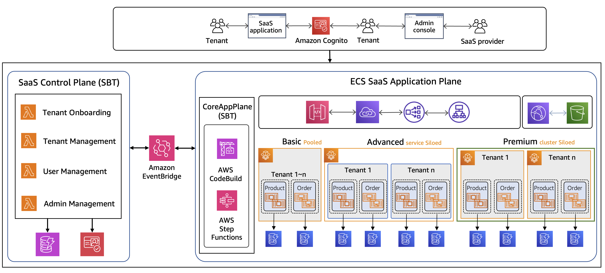

# Amazon ECS SaaS - 참조 아키텍처

**[개발자 문서](DEVELOPER_GUIDE.md)**

## 소개
기업들은 소프트웨어 비즈니스에서 최적화된 비용, 운영 효율성 및 전반적인 민첩성을 달성하기 위해 SaaS(Software-as-a-service) 제공 모델로 전환하고 있습니다. SaaS는 고객(테넌트)을 중앙 호스팅 솔루션에 온보딩하고 단일 관리 창을 통해 관리할 수 있도록 지원합니다. 이러한 SaaS 솔루션은 테넌트 간에 인프라 구성 요소를 공유하면서도, 사용 사례에서 요구하는 전반적인 보안, 성능 및 기타 비기능적 요구사항을 보존하기 위해 아키텍처에서 멀티테넌시를 구현하는 메커니즘이 필요합니다. 이러한 전략과 구현은 사용되는 기술과 AWS 관리형 서비스에 크게 의존합니다.

이 GitHub 솔루션은 Amazon Elastic Container Service(ECS)를 활용하여 멀티테넌트 SaaS 참조 아키텍처를 구현하는 데 도움이 되는 코드 샘플, 구성 및 모범 사례를 제공합니다.

여기서의 목표는 필요한 기술적 측면을 다루는 ECS SaaS 참조 솔루션 구축의 설계 원칙과 구현 세부 사항을 깊이 있게 살펴보는 것입니다. 테넌트 온보딩, 사용자 관리, 관리자 포털과 같은 공유 서비스를 포함한 SaaS 컨트롤 플레인 기능과 함께, ECS 컴퓨팅 격리 전략, 대규모 요청 라우팅, 서비스 디스커버리, 스토리지 격리 패턴, API 스로틀링 및 사용 계획, 그리고 보안과 확장성을 보장하는 다양한 방법에 대해 논의합니다.

## ECS SaaS 참조 솔루션 개요
다음 다이어그램은 ECS SaaS의 핵심 구성 요소를 개괄적으로 보여주는 솔루션의 상위 수준 아키텍처를 나타냅니다. 이것은 티어 기반 SaaS이며, 세 가지 티어는 Amazon ECS를 사용하는 세 가지 다른 테넌트 격리 전략을 나타냅니다. 이를 통해 SaaS 제공업체는 티어링 요구사항에 따라 SaaS 솔루션을 모델링할 수 있는 광범위한 기술 옵션을 가질 수 있습니다.

1. Basic 티어: 모든 테넌트가 ECS 서비스를 공유 (풀 모델)
2. Advanced 티어: ECS 클러스터를 공유하고, 테넌트별 전용 ECS 서비스 (사일로 모델)
3. Premium 티어: 테넌트별 전용 ECS 클러스터 (사일로 모델)

<p align="center">

그림 1: ECS SaaS - 상위 수준 인프라
</p>

이 참조 아키텍처는 [AWS SaaS Factory](https://aws.amazon.com/partners/programs/saas-factory)에서 개발한 최신 [AWS SaaS Builder Toolkit](https://github.com/awslabs/sbt-aws)(SBT)을 채택합니다. SBT는 테넌트 온보딩, 오프보딩, 테넌트 및 사용자 관리, 청구 등과 같은 SaaS 컨트롤 플레인 서비스를 솔루션에 원활하게 확장하는 데 도움이 됩니다. 또한 SaaS 운영을 위한 양방향 통신을 가능하게 하는 ECS 애플리케이션 플레인과의 이벤트 기반 통합을 제공합니다. AWS SBT에 대한 자세한 내용은 [여기](https://github.com/awslabs/sbt-aws/blob/main/docs/public/README.md)를 참조하세요.

## 사전 요구사항
이 솔루션은 AWS 계정에 연결된 로컬 환경을 통해 배포할 수 있습니다.

로컬 환경에는 CDK 빌드 아티팩트를 위한 여유 저장 공간이 필요합니다.

- 이 참조 아키텍처는 Python을 사용합니다. Python 3.11 이상이 설치되어 있는지 확인하세요.
- [AWS CLI v2](https://docs.aws.amazon.com/cli/latest/userguide/cli-chap-install.html)가 설치되어 있는지 확인하세요(최신 버전 권장).
- [Docker](https://docs.aws.amazon.com/serverless-application-model/latest/developerguide/install-docker.html) 호환 런타임이 실행 중인지 확인하세요(예: Docker Desktop, Colima 또는 Rancher Desktop).
- 최신 버전의 [AWS CDK CLI](https://docs.aws.amazon.com/cdk/latest/guide/cli.html)가 설치되어 있는지 확인하세요. 오래된 버전을 사용하면 배포 문제가 발생할 수 있습니다.
- Node.js 22(LTS) 이상이 설치되어 있는지 확인하세요.
- Git이 설치되어 있는지 확인하세요.

## 배포 단계

이 ECS SaaS 참조 솔루션을 배포하려면 아래 명령을 실행할 수 있습니다. ```<admin_email>```을 솔루션에서 관리자 사용자를 생성하고 새 테넌트 온보딩과 같은 관리 작업을 수행할 수 있는 관리자 자격 증명을 공유하는 데 사용할 실제 이메일 주소로 바꾸세요.

```bash
git clone this_repo_url
cd saas-reference-architecture-ecs/scripts
./build-application.sh 
./init-install.sh 
./sbt-install.sh <admin_email>
```

### build-application.sh
샘플 SaaS 애플리케이션 마이크로서비스(order, product, user)용 Docker 컨테이너 이미지를 빌드하고 Amazon ECR에 푸시합니다.

### init-install.sh
핵심 인프라 및 테넌트 템플릿을 배포합니다:

**1. 프로비저닝 소스 설정**
- 참조 솔루션 코드를 저장할 S3 버킷 생성
- 동적 테넌트 프로비저닝(Advanced/Premium 티어)에 사용되는 소스 코드 업로드

**2. CDK 스택: `shared-infra-stack`** (SharedInfraStack)
- 3개의 가용 영역이 있는 Amazon VPC
- Application Load Balancer(ALB)
- 테넌트 라우팅을 위한 API Gateway
- 관리자 및 애플리케이션 사이트용 CloudFront 배포
- 테넌트 매핑을 위한 DynamoDB 테이블
- 액세스 로그용 S3 버킷

**3. CDK 스택: `tenant-template-stack-basic`** (TenantTemplateStack)
- Basic 티어용 ECS 클러스터(풀 모델)
- ECS 서비스: order, product, user 마이크로서비스
- 모든 Basic 티어 테넌트가 공유하는 리소스

**4. CDK 스택: `tenant-template-stack-advanced`** (TenantTemplateStack)
- Advanced 티어용 ECS 클러스터(사일로 모델)
- 클러스터만 생성 - 서비스는 테넌트 온보딩 중에 동적으로 프로비저닝됨

### sbt-install.sh
SaaS 컨트롤 플레인 및 애플리케이션 플레인을 배포합니다:

**1. CDK 스택: `controlplane-stack`** (ControlPlaneStack)
- AWS SaaS Builder Toolkit(SBT) 컨트롤 플레인 구성 요소
- 관리자 인증을 위한 Amazon Cognito
- 테넌트 라이프사이클 이벤트를 위한 EventBridge
- 테넌트 관리 API를 위한 API Gateway
- 관리자 웹 UI 배포

**2. CDK 스택: `core-appplane-stack`** (CoreAppPlaneStack)
- SBT 핵심 애플리케이션 플레인 구성 요소
- 테넌트 온보딩/오프보딩을 위한 AWS CodeBuild 프로젝트
- 프로비저닝 워크플로를 트리거하는 EventBridge 규칙
- 애플리케이션 웹 UI 배포
- EventBridge 이벤트를 통한 컨트롤 플레인과의 통합

## 정리 단계

다음 스크립트를 실행하여 AWS 계정에서 참조 솔루션 리소스를 정리합니다. 아래 스크립트를 실행하기 전에 환경에 [jq](https://jqlang.github.io/jq/download/) JSON 프로세서가 설치되어 있는지 확인하세요.

```bash
cd scripts
./cleanup/cleanup.sh
```

## 라이선스

이 라이브러리는 MIT-0 라이선스에 따라 라이선스가 부여됩니다. [LICENSE](LICENSE) 파일을 참조하세요.

## 보안

자세한 내용은 [CONTRIBUTING](CONTRIBUTING.md#security-issue-notifications)을 참조하세요.
