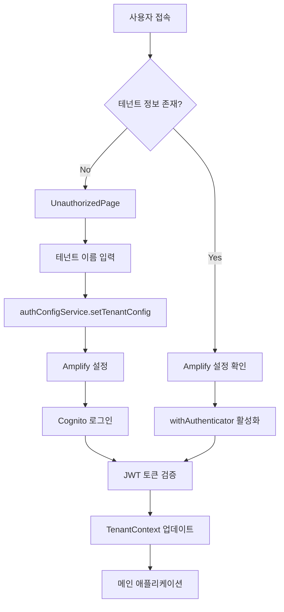
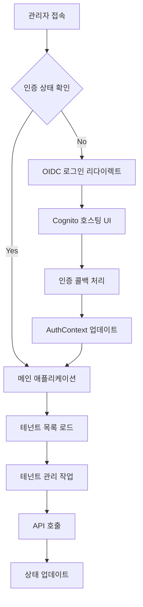

# React SaaS Architecture Analysis

## 개요

이 문서는 ECS SaaS Reference Architecture의 React 기반 웹 애플리케이션 두 개(`Application`과 `AdminWeb`)에 대한 구조와 동작 흐름을 분석합니다.

## 프로젝트 구조

```
client/
├── Application/          # 테넌트 사용자용 애플리케이션
└── AdminWeb/            # 시스템 관리자용 애플리케이션
```

---

## 1. Application (테넌트 사용자용)

### 1.1 프로젝트 구조

```
Application/
├── public/
├── src/
│   ├── components/
│   │   └── Layout/           # 레이아웃 컴포넌트
│   ├── contexts/
│   │   └── TenantContext.tsx # 테넌트 상태 관리
│   ├── pages/
│   │   ├── Dashboard/        # 대시보드
│   │   ├── Products/         # 제품 관리
│   │   ├── Orders/           # 주문 관리
│   │   ├── Users/            # 사용자 관리
│   │   ├── Auth/             # 인증 정보
│   │   └── Error/            # 에러 페이지
│   ├── services/
│   │   ├── authConfigService.ts  # 인증 설정
│   │   ├── productService.ts     # 제품 API
│   │   ├── orderService.ts       # 주문 API
│   │   └── userService.ts        # 사용자 API
│   ├── hooks/                # 커스텀 훅
│   ├── types/                # TypeScript 타입 정의
│   ├── constants/            # 상수 정의
│   └── App.tsx              # 메인 앱 컴포넌트
├── package.json
└── tsconfig.json
```

### 1.2 핵심 기능

#### 인증 시스템
- **AWS Amplify + Cognito** 기반 인증
- **withAuthenticator** HOC 사용
- JWT 토큰에서 `custom:tenantTier` 추출
- 테넌트별 격리된 인증

#### 테넌트 관리
- **TenantContext**를 통한 전역 테넌트 상태 관리
- sessionStorage 기반 테넌트 정보 저장
- 동적 Amplify 설정 (테넌트별 User Pool)

#### 주요 페이지
1. **Dashboard**: 테넌트 정보 및 tier 표시
2. **Products**: 제품 CRUD 작업
3. **Orders**: 주문 생성 및 관리
4. **Users**: 사용자 관리
5. **Auth Info**: JWT 토큰 디버깅 정보

### 1.3 동작 흐름



### 1.4 상태 관리

#### TenantContext
```typescript
interface Tenant {
  id: string;
  name: string;
  tier?: string;
}

interface TenantContextType {
  tenant: Tenant | null;
  setTenant: (tenant: Tenant | null) => void;
  loading: boolean;
  setTenantConfig: (tenantName: string) => Promise<string>;
}
```

#### 주요 특징
- React Context API 사용
- sessionStorage 기반 영속성
- Auth Hub 리스너로 실시간 tier 정보 업데이트

---

## 2. AdminWeb (시스템 관리자용)

### 2.1 프로젝트 구조

```
AdminWeb/
├── public/
├── src/
│   ├── components/
│   │   ├── Layout/           # 레이아웃 컴포넌트
│   │   ├── Auth/             # 인증 관련 컴포넌트
│   │   └── common/           # 공통 컴포넌트
│   ├── contexts/
│   │   └── AuthContext.tsx   # 인증 상태 관리
│   ├── pages/
│   │   ├── Dashboard/        # 대시보드
│   │   ├── Tenants/          # 테넌트 관리
│   │   └── Auth/             # 인증 정보
│   ├── services/
│   │   ├── api.ts            # API 클라이언트
│   │   └── tenantService.ts  # 테넌트 API
│   ├── hooks/
│   │   └── useTenants.ts     # 테넌트 관리 훅
│   ├── models/               # 데이터 모델
│   ├── constants/            # 상수 정의
│   └── App.tsx              # 메인 앱 컴포넌트
├── package.json
└── tsconfig.json
```

### 2.2 핵심 기능

#### 인증 시스템
- **react-oidc-context** 기반 OIDC 인증
- Cognito 호스팅 UI 사용
- 자동 토큰 갱신 및 에러 처리

#### 테넌트 관리
- 테넌트 생성, 조회, 삭제
- 티어별 요금제 관리 (BASIC, ADVANCED, PREMIUM)
- Federation 설정 지원

#### 주요 페이지
1. **Dashboard**: 시스템 개요
2. **Tenant List**: 모든 테넌트 목록
3. **Tenant Create**: 새 테넌트 온보딩
4. **Tenant Detail**: 테넌트 상세 정보 및 삭제

### 2.3 동작 흐름



### 2.4 상태 관리

#### AuthContext
```typescript
interface AuthContextType {
  user: User | null | undefined;
  isAuthenticated: boolean;
  isLoading: boolean;
  error: any;
  login: () => void;
  logout: () => void;
  getAccessToken: () => string | undefined;
  clearError: () => void;
}
```

#### useTenants Hook
```typescript
interface UseTenants {
  tenants: Tenant[];
  loading: boolean;
  error: string | null;
  loadTenants: () => Promise<void>;
  deleteTenant: (tenant: Tenant) => Promise<void>;
}
```

---

## 3. 공통 아키텍처 패턴

### 3.1 폴더 구조 패턴
- **pages/**: 라우트별 페이지 컴포넌트
- **components/**: 재사용 가능한 UI 컴포넌트
- **contexts/**: React Context 기반 상태 관리
- **services/**: API 통신 로직
- **hooks/**: 커스텀 훅
- **types/models/**: TypeScript 타입 정의
- **constants/**: 상수 및 설정

### 3.2 상태 관리 패턴
- **React Context API**: 전역 상태 관리
- **Custom Hooks**: 비즈니스 로직 분리
- **Local State**: 컴포넌트별 상태

### 3.3 API 통신 패턴
- **Service Layer**: API 호출 로직 분리
- **Error Handling**: 중앙화된 에러 처리
- **Token Management**: 자동 토큰 주입

### 3.4 라우팅 패턴
- **React Router v6**: 선언적 라우팅
- **Protected Routes**: 인증 기반 라우트 보호
- **Nested Routes**: 계층적 라우트 구조

---

## 4. 기술 스택 비교

| 구분 | Application | AdminWeb |
|------|-------------|----------|
| **인증** | AWS Amplify + Cognito | react-oidc-context |
| **상태관리** | Context API | Context API + Custom Hooks |
| **UI 라이브러리** | Material-UI | Material-UI |
| **라우팅** | React Router v6 | React Router v6 |
| **HTTP 클라이언트** | fetch (내장) | axios |
| **타입스크립트** | ✅ | ✅ |

---

## 5. 보안 고려사항

### 5.1 Application
- JWT 토큰 기반 인증
- 테넌트별 격리된 데이터 접근
- sessionStorage 사용 (XSS 방지)
- HTTPS 강제

### 5.2 AdminWeb
- OIDC 표준 준수
- 자동 토큰 갱신
- CSRF 보호
- 관리자 권한 검증

---

## 6. 성능 최적화

### 6.1 번들 크기
- **Application**: ~353KB (gzipped)
- **AdminWeb**: ~177KB (gzipped)

### 6.2 최적화 기법
- Code Splitting (React.lazy)
- Tree Shaking
- 이미지 최적화
- 메모이제이션 (useMemo, useCallback)

---

## 7. 배포 및 운영

### 7.1 빌드 설정
- Create React App 기반
- TypeScript 컴파일
- ESLint + Prettier
- 환경별 설정 분리

### 7.2 Docker 지원
- Nginx 기반 정적 파일 서빙
- 멀티 스테이지 빌드
- 환경 변수 주입

---

## 8. 개선 제안사항

### 8.1 단기 개선
- React Query/SWR 도입 (캐싱 및 동기화)
- Error Boundary 추가
- 로딩 상태 개선
- 접근성(a11y) 향상

### 8.2 장기 개선
- Micro Frontend 아키텍처 검토
- PWA 기능 추가
- 실시간 알림 시스템
- 다국어 지원

---

## 결론

두 React 애플리케이션은 각각의 목적에 맞게 잘 설계되었으며, 현대적인 React 개발 패턴을 따르고 있습니다. 특히 Context API를 활용한 상태 관리, 커스텀 훅을 통한 로직 분리, TypeScript를 통한 타입 안정성 확보 등이 잘 구현되어 있습니다.

각 애플리케이션의 인증 방식과 상태 관리 패턴이 다르지만, 이는 각각의 사용 사례에 최적화된 선택으로 보입니다.

---

## 9. Cognito 인증 프로세스 상세 분석

### 9.1 Application (AWS Amplify + Cognito)

#### 인증 플로우 다이어그램
```mermaid
sequenceDiagram
    participant U as User
    participant A as Application
    participant T as TenantContext
    participant AC as AuthConfigService
    participant API as Tenant Config API
    participant C as Cognito
    participant AMP as Amplify

    U->>A: 1. 애플리케이션 접속
    A->>T: 2. 테넌트 정보 확인
    T-->>A: 3. 테넌트 없음
    A->>U: 4. UnauthorizedPage 표시
    
    U->>A: 5. 테넌트 이름 입력 ("adv004")
    A->>AC: 6. setTenantConfig(tenantName)
    AC->>API: 7. GET /tenant-config/{tenantName}
    
    Note over API: 파라미터: tenantName="adv004"
    API-->>AC: 8. 응답 데이터
    Note over AC: {
      userPoolId: "ap-northeast-2_znj5rT26i",
      appClientId: "6v1015kujbpmp5k0r4r167ud3f",
      apiGatewayUrl: "https://api.example.com",
      tier: "ADVANCED"
    }
    
    AC->>AC: 9. sessionStorage 저장
    Note over AC: app_userPoolId, app_appClientId,<br/>app_tenantName, app_apiGatewayUrl
    
    AC-->>A: 10. 설정 완료
    A->>AMP: 11. Amplify.configure()
    Note over AMP: {
      aws_user_pools_id: userPoolId,
      aws_user_pools_web_client_id: appClientId,
      Auth: { storage: sessionStorage }
    }
    
    A->>C: 12. withAuthenticator 활성화
    C->>U: 13. Cognito 호스팅 UI 표시
    U->>C: 14. 로그인 (username/password)
    
    C->>C: 15. 사용자 인증
    C-->>AMP: 16. JWT 토큰 반환
    Note over C: {
      idToken: "eyJ...",
      accessToken: "eyJ...",
      refreshToken: "eyJ..."
    }
    
    AMP->>T: 17. Auth Hub 이벤트 (signIn)
    T->>AMP: 18. currentAuthenticatedUser()
    AMP-->>T: 19. 사용자 정보 + 속성
    Note over T: {
      username: "user123",
      attributes: {
        email: "user@adv004.com",
        "custom:tenantTier": "ADVANCED"
      }
    }
    
    T->>T: 20. Tenant 객체 업데이트
    T-->>A: 21. 인증 완료
    A->>U: 22. 메인 애플리케이션 표시
```

#### 주요 파라미터 및 결과값

**1. Tenant Config API 호출**
```typescript
// 요청
GET /tenant-config/adv004

// 응답
{
  "userPoolId": "ap-northeast-2_znj5rT26i",
  "appClientId": "6v1015kujbpmp5k0r4r167ud3f", 
  "apiGatewayUrl": "https://1ygh9dyq7b.execute-api.ap-northeast-2.amazonaws.com/prod/",
  "tier": "ADVANCED"
}
```

**2. Amplify 설정**
```typescript
{
  aws_project_region: "ap-northeast-2",
  aws_cognito_region: "ap-northeast-2",
  aws_user_pools_id: "ap-northeast-2_znj5rT26i",
  aws_user_pools_web_client_id: "6v1015kujbpmp5k0r4r167ud3f",
  Auth: {
    storage: sessionStorage
  }
}
```

**3. Cognito JWT 토큰 구조**
```typescript
// ID Token Payload
{
  "sub": "user-uuid",
  "email": "user@adv004.com",
  "email_verified": true,
  "custom:tenantTier": "ADVANCED",
  "cognito:username": "user123",
  "aud": "6v1015kujbpmp5k0r4r167ud3f",
  "iss": "https://cognito-idp.ap-northeast-2.amazonaws.com/ap-northeast-2_znj5rT26i"
}
```

### 9.2 AdminWeb (OIDC + Cognito)

#### 인증 플로우 다이어그램
```mermaid
sequenceDiagram
    participant U as Admin User
    participant A as AdminWeb
    participant AC as AuthContext
    participant OIDC as react-oidc-context
    participant C as Cognito Hosted UI
    participant API as Backend API

    U->>A: 1. 관리자 페이지 접속
    A->>AC: 2. 인증 상태 확인
    AC->>OIDC: 3. useAuth() 호출
    OIDC-->>AC: 4. isAuthenticated: false
    
    AC->>C: 5. signinRedirect()
    Note over C: OIDC 설정:
    authority: "https://cognito-idp.region.amazonaws.com/userPoolId",
    client_id: "adminClientId",
    redirect_uri: "https://admin.example.com",
    response_type: "code",
    scope: "openid email profile"
    
    C->>U: 6. Cognito 호스팅 UI 표시
    U->>C: 7. 관리자 로그인
    C->>C: 8. 인증 처리
    
    C->>A: 9. 콜백 리다이렉트 (with code)
    Note over A: https://admin.example.com/callback?code=abc123&state=xyz
    
    A->>OIDC: 10. 인증 코드 처리
    OIDC->>C: 11. 토큰 교환 요청
    Note over OIDC: POST /oauth2/token
    {
      grant_type: "authorization_code",
      client_id: "adminClientId",
      code: "abc123",
      redirect_uri: "https://admin.example.com"
    }
    
    C-->>OIDC: 12. 토큰 응답
    Note over C: {
      access_token: "eyJ...",
      id_token: "eyJ...",
      token_type: "Bearer",
      expires_in: 3600
    }
    
    OIDC->>AC: 13. 사용자 정보 업데이트
    AC-->>A: 14. isAuthenticated: true
    A->>U: 15. 관리자 대시보드 표시
    
    U->>A: 16. 테넌트 관리 작업
    A->>API: 17. API 호출 (with Bearer token)
    Note over API: Authorization: Bearer {access_token}
    API-->>A: 18. 응답 데이터
    A->>U: 19. 결과 표시
```

#### OIDC 설정 파라미터
```typescript
// environment.ts
export const oidcConfig = {
  authority: "https://cognito-idp.ap-northeast-2.amazonaws.com/ap-northeast-2_userPoolId",
  client_id: "adminAppClientId",
  redirect_uri: `${window.location.origin}/callback`,
  response_type: "code",
  scope: "openid email profile",
  automaticSilentRenew: true,
  loadUserInfo: true,
  post_logout_redirect_uri: window.location.origin
};
```

---

## 10. Backend REST API 호출 분석

### 10.1 Application API 호출 구조

#### HTTP Client 설정
```typescript
// httpClient.ts
class HttpClient {
  private getAuthHeaders(): Record<string, string> {
    const user = getCurrentUser();
    if (user?.signInUserSession) {
      return {
        'Authorization': `Bearer ${user.signInUserSession.accessToken.jwtToken}`,
        'Content-Type': 'application/json'
      };
    }
    return { 'Content-Type': 'application/json' };
  }

  async get<T>(url: string): Promise<AxiosResponse<T>> {
    return axios.get(url, { headers: this.getAuthHeaders() });
  }
}
```

#### API 서비스별 엔드포인트

**1. Product Service**
```typescript
// productService.ts
class ProductService {
  private get baseUrl(): string {
    return `${sessionStorage.getItem('app_apiGatewayUrl')}/products`;
  }

  // GET /products
  async fetch(): Promise<Product[]> {
    const response = await httpClient.get<Product[]>(this.baseUrl);
    return response.data;
  }

  // POST /products
  async create(product: CreateProductRequest): Promise<Product> {
    const response = await httpClient.post<Product>(this.baseUrl, product);
    return response.data;
  }

  // PUT /products/{id}
  async update(id: string, product: UpdateProductRequest): Promise<Product> {
    const response = await httpClient.put<Product>(`${this.baseUrl}/${id}`, product);
    return response.data;
  }

  // DELETE /products/{id}
  async delete(id: string): Promise<void> {
    await httpClient.delete(`${this.baseUrl}/${id}`);
  }
}
```

**2. Order Service**
```typescript
// orderService.ts
class OrderService {
  private get baseUrl(): string {
    return `${sessionStorage.getItem('app_apiGatewayUrl')}/orders`;
  }

  // GET /orders
  async fetch(): Promise<Order[]> {
    const response = await httpClient.get<Order[]>(this.baseUrl);
    return response.data;
  }

  // GET /orders/{tenantId}:{orderId}
  async get(orderKey: string): Promise<Order> {
    const response = await httpClient.get<Order>(`${this.baseUrl}/${orderKey}`);
    return response.data;
  }

  // POST /orders
  async create(order: Omit<Order, 'key' | 'tenantId' | 'orderId'>): Promise<Order> {
    const response = await httpClient.post<Order>(this.baseUrl, order);
    return response.data;
  }
}
```

**3. User Service**
```typescript
// userService.ts
class UserService {
  private get baseUrl(): string {
    return `${sessionStorage.getItem('app_apiGatewayUrl')}/users`;
  }

  // GET /users
  async fetch(): Promise<User[]> {
    const response = await httpClient.get<User[]>(this.baseUrl);
    return response.data;
  }

  // POST /users
  async create(user: CreateUserRequest): Promise<User> {
    const response = await httpClient.post<User>(this.baseUrl, user);
    return response.data;
  }
}
```

### 10.2 AdminWeb API 호출 구조

#### API Client 설정
```typescript
// api.ts
class ApiService {
  private tokenProvider: (() => string | undefined) | null = null;

  setTokenProvider(provider: () => string | undefined) {
    this.tokenProvider = provider;
  }

  private getHeaders(): Record<string, string> {
    const headers: Record<string, string> = {
      'Content-Type': 'application/json',
    };

    if (this.tokenProvider) {
      const token = this.tokenProvider();
      if (token) {
        headers['Authorization'] = `Bearer ${token}`;
      }
    }

    return headers;
  }

  async get<T>(url: string): Promise<T> {
    const response = await axios.get<T>(url, { headers: this.getHeaders() });
    return response.data;
  }
}
```

#### Tenant Management API
```typescript
// tenantService.ts
class TenantService {
  private readonly baseUrl = environment.apiUrl;

  // GET /tenant-registrations
  async getTenants(): Promise<TenantRegistrationData[]> {
    const url = `${this.baseUrl}/tenant-registrations`;
    return apiService.get<TenantRegistrationData[]>(url);
  }

  // GET /tenant-registrations/{id}
  async getTenant(id: string): Promise<TenantRegistrationData> {
    const url = `${this.baseUrl}/tenant-registrations/${id}`;
    return apiService.get<TenantRegistrationData>(url);
  }

  // POST /tenant-registrations
  async createTenant(tenant: CreateTenantRequest): Promise<any> {
    const url = `${this.baseUrl}/tenant-registrations`;
    return apiService.post(url, tenant);
  }

  // DELETE /tenant-registrations/{id}
  async deleteTenant(tenant: any): Promise<any> {
    const tenantRegistrationId = tenant.tenantRegistrationData.tenantRegistrationId;
    const url = `${this.baseUrl}/tenant-registrations/${tenantRegistrationId}`;
    return apiService.delete(url);
  }
}
```

### 10.3 API 호출 플로우 다이어그램

```mermaid
sequenceDiagram
    participant C as Component
    participant S as Service
    participant H as HttpClient
    participant API as Backend API
    participant DB as Database

    C->>S: 1. API 메서드 호출
    Note over C: productService.fetch()
    
    S->>S: 2. URL 구성
    Note over S: baseUrl = sessionStorage.getItem('app_apiGatewayUrl') + '/products'
    
    S->>H: 3. HTTP 요청
    H->>H: 4. 인증 헤더 추가
    Note over H: Authorization: Bearer {JWT_TOKEN}
    
    H->>API: 5. HTTP Request
    Note over API: GET /products
    Headers: {
      Authorization: "Bearer eyJ...",
      Content-Type: "application/json"
    }
    
    API->>API: 6. JWT 토큰 검증
    API->>API: 7. 테넌트 격리 확인
    API->>DB: 8. 데이터베이스 쿼리
    Note over DB: SELECT * FROM products WHERE tenantId = 'adv004'
    
    DB-->>API: 9. 쿼리 결과
    API-->>H: 10. HTTP Response
    Note over API: {
      "data": [
        {
          "productId": "prod-1",
          "name": "Widget A",
          "price": 29.99,
          "tenantId": "adv004"
        }
      ]
    }
    
    H-->>S: 11. 응답 데이터
    S-->>C: 12. 파싱된 데이터
    C->>C: 13. UI 업데이트
```

### 10.4 에러 처리 및 재시도 로직

```typescript
// Error handling in httpClient
class HttpClient {
  async request<T>(config: AxiosRequestConfig): Promise<AxiosResponse<T>> {
    try {
      return await axios.request<T>(config);
    } catch (error: any) {
      if (error.response?.status === 401) {
        // Token expired - redirect to login
        window.location.href = '/unauthorized';
      } else if (error.response?.status === 403) {
        // Insufficient permissions
        throw new Error('Access denied');
      } else if (error.response?.status >= 500) {
        // Server error - retry logic could be added here
        throw new Error('Server error occurred');
      }
      throw error;
    }
  }
}
```

### 10.5 API 엔드포인트 요약

#### Application APIs
| 서비스 | 메서드 | 엔드포인트 | 설명 |
|--------|--------|------------|------|
| **Product** | GET | `/products` | 제품 목록 조회 |
| | POST | `/products` | 제품 생성 |
| | PUT | `/products/{id}` | 제품 수정 |
| | DELETE | `/products/{id}` | 제품 삭제 |
| **Order** | GET | `/orders` | 주문 목록 조회 |
| | GET | `/orders/{key}` | 주문 상세 조회 |
| | POST | `/orders` | 주문 생성 |
| **User** | GET | `/users` | 사용자 목록 조회 |
| | POST | `/users` | 사용자 생성 |

#### AdminWeb APIs
| 서비스 | 메서드 | 엔드포인트 | 설명 |
|--------|--------|------------|------|
| **Tenant** | GET | `/tenant-registrations` | 테넌트 목록 조회 |
| | GET | `/tenant-registrations/{id}` | 테넌트 상세 조회 |
| | POST | `/tenant-registrations` | 테넌트 생성 |
| | DELETE | `/tenant-registrations/{id}` | 테넌트 삭제 |
| **Config** | GET | `/tenant-config/{name}` | 테넌트 설정 조회 |